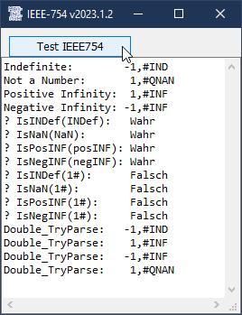

# IEEE754_Infinity  
## Functions for working with infinity & co. in your app  

 

Project started in dec 2011.  
Sometimes it is helpful to check if a number has reached any datatype specific boundaries, in order to convert it to the appropriate string.
This repo shows that infinity and some other special numbers are already defined in the floating point specifications (aka IEEE754), and how to deal with it in VBA/VBC.

Links:  
[IEEE-754-2019](https://ieeexplore.ieee.org/document/8766229)  
[Wikipedia-en:IEEE754](https://en.wikipedia.org/wiki/IEEE_754#2019)  
[Wikipedia-de:IEEE754](https://de.wikipedia.org/wiki/IEEE_754)  
[VB 5/6-Tipp 0747: Positiv und negativ Unendlich darstellen](http://www.activevb.de/tipps/vb6tipps/tipp0747.html)   

